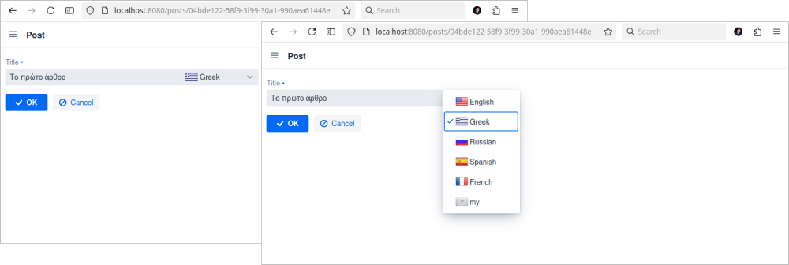
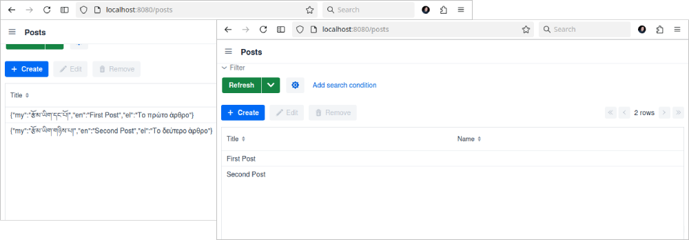
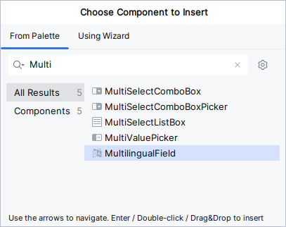
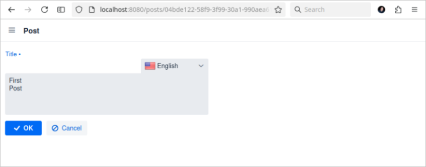
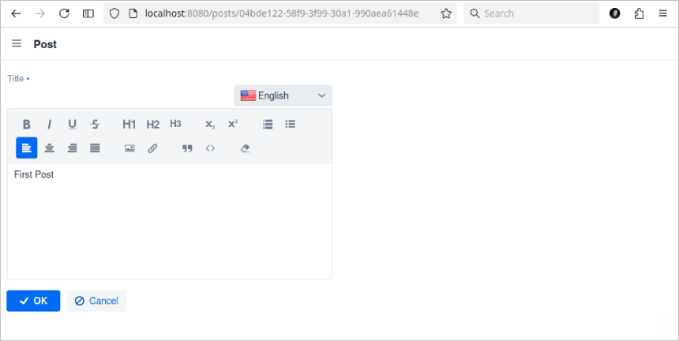
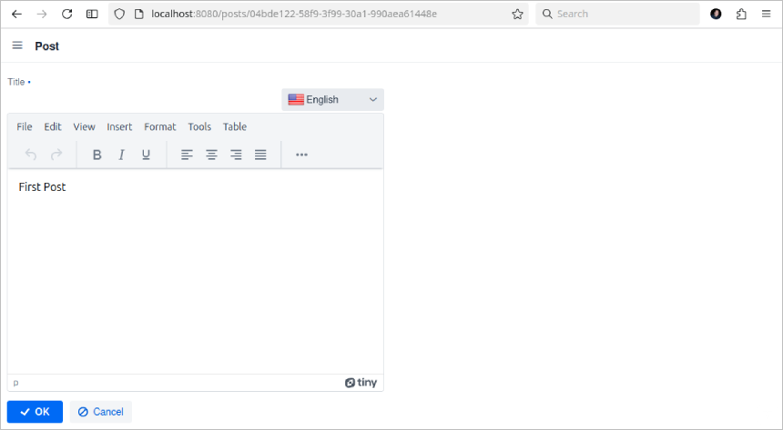

image::https://img.shields.io/badge/license-Apache%20License%202.0-blue.svg?style=flat[license,link=http://www.apache.org/licenses/LICENSE-2.0,window=_blank,opts=nofollow]

= MultilingualField for Jmix

This add-on provides a custom datatype, a related field and a dataGrid column renderer, for storing, editing and displaying multilingual string values.

== Installation

The following table shows which version of the add-on is compatible with which version of the platform:

[options="autowidth,header"]
|===
|Jmix Version|Add-on Version|Implementation
|2.4.1|1.0.0|gr.netmechanics.jmix:jmix-multilingual-field-starter:1.0.0
|===

For manual installation, add the following dependencies to your `build.gradle`:

[,gradle]
----
implementation 'gr.netmechanics.jmix:jmix-multilingual-field-starter:<addon-version>'
----

== How to use the add-on

=== Datatype

Add-on provides a new datatype `MultilingualString`.

You can define an entity attribute with the `MultilingualString` datatype using Studio.

As a result, Studio generates the following attribute definition:

[,java]
----
@Column(name = "TITLE")
private MultilingualString title;
----

[NOTE]
====
The actual value stored in the database is a JSON string.

{"en":"Computer","el":"Ηλεκτρονικός υπολογιστής"}
====

=== Field

In a detail view you can add the field from studio `Component Palette` window

or through code

[,xml]
----
<view xmlns="http://jmix.io/schema/flowui/view"
        xmlns:nm="http://schemas.netmechanics.gr/jmix/ui"
        focusComponent="form">
    ...
    <layout>
        <formLayout id="form">
            <nm:multilingualField id="titleField" property="title"/>
        </formLayout>
        ...
    </layout>
</view>
----

=== DataGrid Column Renderer

In a list view you can add the renderer from studio `Jmix UI context menu`

or through code

[,xml]
----
<view xmlns="http://jmix.io/schema/flowui/view" 
      xmlns:nm="http://schemas.netmechanics.gr/jmix/ui" 
      focusComponent="postsDataGrid">
    ...
    <layout>
        ...
        <dataGrid id="postsDataGrid" width="100%" 
                  minHeight="20em" dataContainer="postsDc">
            <columns resizable="true">
                <column property="title">
                    <nm:multilingualStringRenderer/>
                </column>
            </columns>
        </dataGrid>
        ...
    </layout>
</view>
----

TIP: The default locale will be used to render the column.

== Configuration

=== Locale Modes

The add-on provides two modes for defining supported locales.

SYSTEM:: This mode utilizes the locales specified in the `jmix.core.available-locales` property.

USER::
The `jmix.mlf.user-locales` application property allows you to define locales as a list of language codes following the https://en.wikipedia.org/wiki/List_of_ISO_639_language_codes[ISO 639-1,window=_blank] standard.
+
[,properties]
----
jmix.mlf.user-locales=en,el,ru,es,fr,my
----
+
Alternatively to dynamically specify locales at runtime, you can implement the `gr.netmechanics.jmix.mlf.locales.UserLocales` interface and provide its implementation through the application property `jmix.mlf.user-locales-app-setting-class`. For instance, this can be achieved using an AppSetting.
+
[,java]
----
package com.example.entity;

import io.jmix.appsettings.entity.AppSettingsEntity;
import gr.netmechanics.jmix.mlf.locales.UserLocales;

@JmixEntity
@Table(name = "EXMP_SYSTEM_SETTINGS")
@Entity(name = "EXMP_SystemSettings")
public class SystemSettings extends AppSettingsEntity implements UserLocales { 
    @AppSettingsDefault("en") 
    @Column(name = "LOCALES") 
    private String locales;

    @Override
    public String getLocales() {
        return locales;
    }
    
    public void setLocales(final String locales) {
        this.locales = locales;
    }
}
----
+
[,properties]
----
jmix.mlf.user-locales-app-setting-class=com.example.entity.SystemSettings
----

TIP: In both modes, the selection options in the UI field are arranged in the same order as the locales, with the first specified locale serving as the default.

The default mode is `SYSTEM`. You can select the desired mode by configuring the `jmix.mlf.locale-mode` application property.

[,properties]
----
jmix.mlf.locale-mode=USER
----

=== UI Field

==== Field Type

There are three types for the UI field

SINGLE:: A single-line text input component will be used. This is the default type unless another type is specified.
+

MULTI:: A multiline-line text input component will be used.
+

RTF:: The Jmix's RichTextEditor component will be used.
+

Additionally, you can use a field provider which will return a component. 

For example using the https://www.jmix.io/marketplace/jmix-tinymce/[TinyMCE Editor,window=_blank] add-on:

[,java]
----
@Install(to = "titleField", subject = "fieldProvider") 
private AbstractField<?, String> titleFieldFieldProvider() {
    TinyMceEditor tinyMceEditor = uiComponents.create(TinyMceEditor.class);
    TinyMceConfigUtil.applyConfig(tinyMceEditor, TinyMceConfigMode.BASIC);
    tinyMceEditor.setHeight("400px");
    return tinyMceEditor;
}
----

==== Properties

* `fieldType` - sets the field type, SINGLE, MULTI or RTF values can be used.
* `multilineHeight` - sets the height of the multi-line text input component if used.
* `multilineMinHeight` - sets the min-height of the multi-line text input component if used.
* `multilineMaxHeight` - sets the max-height of the multi-line text input component if used.

==== Validation

If the field is bound to a required entity attribute, then the edit fields also become required:

For the field to be valid, values must be provided for all locales. To validate only the default locale set the `jmix.mlf.validate-default-locale-only` application property to true.

[,properties]
----
jmix.mlf.validate-default-locale-only=true
----

==== UI Flags

The supported locales for the field are listed below. If an unsupported locale is used, the unknown flag will be displayed.

[%autowidth,cols="a,a,a,a,a"]
|===
|image:./mlf/src/main/resources/META-INF/resources/icons/sq.png[width=24] Albanian (sq)
|image:./mlf/src/main/resources/META-INF/resources/icons/hy.png[width=24] Armenian (hy)
| Bulgarian (bg)
|image:./mlf/src/main/resources/META-INF/resources/icons/zh.png[width=24] Chinese (zh)
| Croatian (hr)
|image:./mlf/src/main/resources/META-INF/resources/icons/cs.png[width=24] Czech (cs)
|image:./mlf/src/main/resources/META-INF/resources/icons/da.png[width=24] Danish (da)
|image:./mlf/src/main/resources/META-INF/resources/icons/nl.png[width=24] Dutch (nl)
|image:./mlf/src/main/resources/META-INF/resources/icons/en.png[width=24] English (en)
|image:./mlf/src/main/resources/META-INF/resources/icons/et.png[width=24] Estonian (et)
|image:./mlf/src/main/resources/META-INF/resources/icons/fi.png[width=24] Finnish (fi)
|image:./mlf/src/main/resources/META-INF/resources/icons/fr.png[width=24] French (fr)
|image:./mlf/src/main/resources/META-INF/resources/icons/de.png[width=24] German (de)
|image:./mlf/src/main/resources/META-INF/resources/icons/el.png[width=24] Greek (el)
| Hebrew (he)
|image:./mlf/src/main/resources/META-INF/resources/icons/hi.png[width=24] Hindi (hi)
| Hungarian (hu)
|image:./mlf/src/main/resources/META-INF/resources/icons/it.png[width=24] Italian (it)
|image:./mlf/src/main/resources/META-INF/resources/icons/ja.png[width=24] Japanese (ja)
|image:./mlf/src/main/resources/META-INF/resources/icons/ko.png[width=24] Korean (ko)
| Lithuanian (lt)
| Maltese (mt)
|image:./mlf/src/main/resources/META-INF/resources/icons/no.png[width=24] Norwegian (no)
| Polish (pl)
|image:./mlf/src/main/resources/META-INF/resources/icons/pt.png[width=24] Portuguese (pt)
| Romanian (ro)
|image:./mlf/src/main/resources/META-INF/resources/icons/ru.png[width=24] Russian (ru)
| Serbian (sr)
|image:./mlf/src/main/resources/META-INF/resources/icons/es.png[width=24] Spanish (es)
|image:./mlf/src/main/resources/META-INF/resources/icons/sv.png[width=24] Swedish (sv)
|image:./mlf/src/main/resources/META-INF/resources/icons/th.png[width=24] Thai (th)
|image:./mlf/src/main/resources/META-INF/resources/icons/tr.png[width=24] Turkish (tr)
|image:./mlf/src/main/resources/META-INF/resources/icons/vi.png[width=24] Vietnamese (vi)
|
|image:./mlf/src/main/resources/META-INF/resources/icons/xx.png[width=24] Unknown
|===

== Limitations

Since the actual value stored in the database is a JSON string (`CLOB`), there are the following limitations:

* `GenericFilter` and `PropertyFilter` components are not supported.
* Sorting is applied using the default locale.
